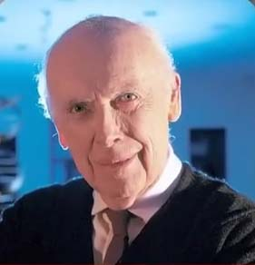
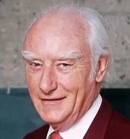
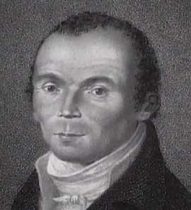

در سال 1953 جیمز واتسون و فرانسیس کریک دانشمندان انگیسی

    
    

با استفاده از تصویربرداری اشعه ایکس ساختار دو رشته ای مارپیچی دی ان ای را  کشف کردند این ساختار شامل دو رشته مکمله که از این طریق به همدیگه وصل میشن

وجود زوجیت در سطح مولکولی و زیستیه
ادوین هابل

    

با استفاده از تلسکوپ مونت ویلسون 

    
    

کهکشان آندرومدا یا ام سی و یک را کشف میکنه و ثابت میکنه که این کهکشان بیرون از کهکشان راه شیریه و یک کهکشان مستقله و دقیقا شبیه کهکشان راه شیریه
کریستین شپرِنگِل دانشمند آلمانی در سال 1973 در کتاب معروف خود به نام راز کشف شده گل ها و گیاهان گلدار اولین کسی بود که به طور علمی و تجربی 

    
    

ثابت میکنه که در گیاهان زوجیت وجود داره
و در سال 1923 پل دیراک دانشمند بریتانیایی با کشف پاد ذره ثابت میکنه که هر زره ای در جهان دارای جفت یا همتایی است 

    
    

و به خاطر این کشف علمی بزرگ جایزه نوبل گرفت و حقیقت علمی شگفت انگیزی را آشکار میکنه که همه چیز در جهان بر اساس زوجیت خلق شده
و چه زیبا خداوند 1400 سال قبل در آیه 49 سوره ذاریات می فرماید :

از هر چیز زوج آفریدیم شاید پند گیرید .