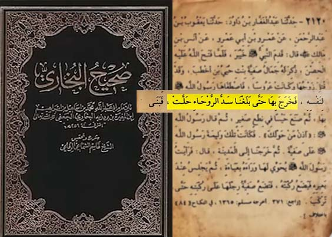

other : تا دیروز شما میگفتین که زمانی که بخواین با یک اسیر زن ازدواج بکنی باید حتما عده بگذرونه
other : ولی خب پیامبرتون من نمیدونم خونش از بقیه رنگین تره چطور بوده که میاد اصلا نمیگذاره خون اون بنده خدا خشک بشه
me : کجا و کی ؟
other : صفیه زن پیامبر اصلا نذاشت خون بنده خدا خشک بشه همونجا اومد صفیه رو عقدش کرد خوب چرا نذاشت عده بگذرونه ؟
me : ببینید طبق منابع معتبر تاریخی بعد از فتح خیبر همسر حضرت صفیه کشته میشه و ایشون هم اسیر میشه پیامبر میاد اسلام رو به حضرت صفیه معرفی میکنه و به ایشون میگه شما آزاد هستین میتونی یهودی بمونی میتونی اسلام رو انتخاب بکنی ، حضرت صفیه میگه من الله و رسول رو انتخاب می کنم ، پیامبر میاد حضرت صفیه رو آزاد میکنه و **بعد از گذراندن عده** با ایشون ازدواج میکنه اینجا عده گذرونده شده . چرا دارید میگین عده گذرونده نشده ؟
other : کجا عده گذرونده ؟ تو کدوم منابع تاریخی اومده که عده گذرونده شده ؟
me : ببینید در اکثر منابع تاریخی اومده یکی از مهم ترین کتاب مسلمونا بعد از قرآن کتاب **صحیح بخاریه**
me : 
me : در حدیث 2120 به صراحت اومده که صفیه عده گذرونده
me : در **سنن ابن داوود** اومده
me : در **سیره ابن هشام** اومده
me : در **طبقات ابن سعد** اومده
me : و اگر بخوام بهتون بگم هزاران منبع اسلامی وجود داره
me : پس حضرت صفیه **عده گذروند**