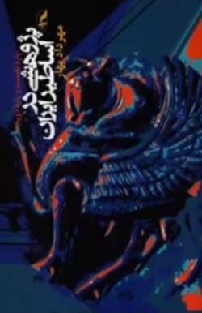
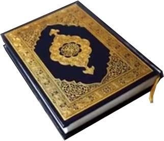
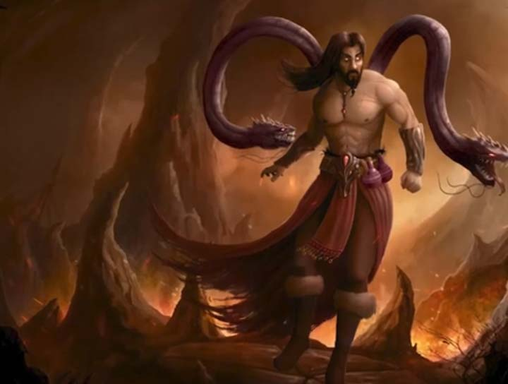
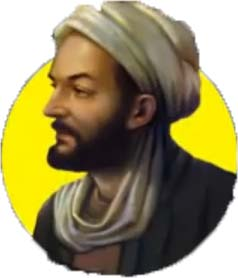

# ادعا

<video src="./claim.mp4" controls>

# پاسخ

مهرداد بهار در کتاب پژوهشی در اساطیر ایرانی میگه 

 

    
    

عمر طولانی رستم نمادین و ادبیه و برای نشون دادن عظمت و پایداری قهرمانان ایرانیه و عمر 700 ساله رستم واقعی نیست
نوح 950 سال در میان قومش به دعوت به توحید و پرهیز از شرک پرداخت ، ذکر عمر طولانی نوح به مومنان می آموزه که در راه حق باید صبور و مقاوم باشن حتی اگر سال ها طول بکشه تا به نتیجه برسن منبع :

    
    
    

#### قرآن ، تورات ، انجیل
جلال ستاری اسطوره شناس و پژوهشگر برجسته ایرانی در کتاب جهان اسطوره شناسی میگه :

    
    
    

پرواز کیکاووس با عقاب داستانی غیر واقعی و نمادین برای نشون دادن خلاقیت و آرمان های بلند ایرانیه
داستان پرواز سلیمان با قالیچه داستان خرافی و ساختگیه که هیچ منبع و سند تاریخی و دینی نداره

    

بر اساس داستان ها ضحاک پادشاه ظالم و ستمگری بود که شیطان او را فریب داد و دومار روی دوش او ظاهر شد
دیک دیویس مترجم برجسته شاهنامه به انگلیسی میگه :

    

داستان ضحاک یک روایت اسطوره ای غیر واقعی که برای نشون دادن مبارزه خیر و شر و اهمیت عدالت در فرهنگ ایرانی نوشته شده
زمانی که موسی به فرمان خدا نزد فرعون رفت خدا به او دستور داد عصاشو بندازه ، عصای موسی به فرمان خدا تبدیل به یک مار بزرگ شد تا قدرت خدا را به فرعون نشون بده منبع قران سوره طه آیه 20 و تورات فصل 4 آیه 3

ژاله آموزگار اسطوره شناس و پژوهشگر ادبیات ایران باستان در کتاب تاریخ اساطیری ایران میگه :

    
    
    

داستان سیمرغ و زال از نظر تاریخی واقعی نیستن و در حوزه اسطوره و حماسه جای میگیرن 
یونس در شکم ماهی **پرورش نیافت**  بلکه به دلیل ترک قومش بدون اجازه الهی مورد آزمون قرار گرفت این داستان هشداری است به پیامبران و بندگان صالح که باید صبر کنن و به وظیفه خود پایبند بمونن منبع قرآن تورات و انجیل

هویت ایرانی در کوروش ، فردوسی ، حافظ و ابن سینا میدرخشه و به جای تعصب عقل و منطق رو ترویج کنیم

    
    
    
    
    

افتخار ما در تمدن ، علم و فرهنگ غنی ماست و پیامبر اسلام در حدیث صحیح می فرمایند
#### اگر ایمان به ستاره ثریا معلق باشد مردانی از فرزندان پارس به آن دست می یابند