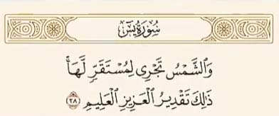
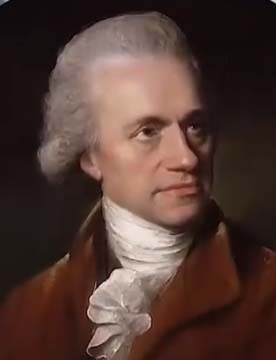
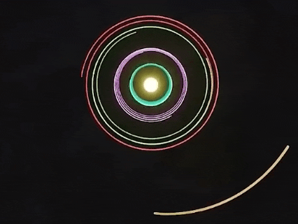

# ادعا 

<video src="./claim.mp4" comtorls>

# جواب

ایه 38 سوره یس به حرکت خورشید اشاره داره

نه تنها این آیه با یافته های علمی مدرن تضاد نداره بلکه کاملا همخانی داره 
از قرن 18 و 19 میلادی دانشمندانی همچون ویلیان هرشل نظریه حرکت مداری خورشید را مطرح کردند

    

خورشید به همراه منظومه شمسی با سرعت تقریبی 828,000 کیلومتر در ساعت به یک سمت مشخصی که دانشمندان اون را سولاری پکز نامیده اند درحال حرکته

این کشف علمی که بعدها با ابزار های پیشرفته تر در قرن 20 و 21 تایید شد نشان دهنده هماهنگی علم و قرآن هست 
در زمانی که بشر گمان می کرد خورشید به دور زمین می چرخه قرآن از حقیقتی سخن گفت که قرن ها بعد با علم نجوم شناسی اثبات شد این آیه نظم و قدرت بی پایان خداوند در تدبیر جهان هستی را به تصویر میکشه
حقیقتی که تنها امروزه با پیشرفت علم کیهان شناسی اثبات شده و برای بشری که در 1400 سال قبل زندگی میکرد امری دست نیافتنی بود 
#### آیا این معجزه نیست ؟