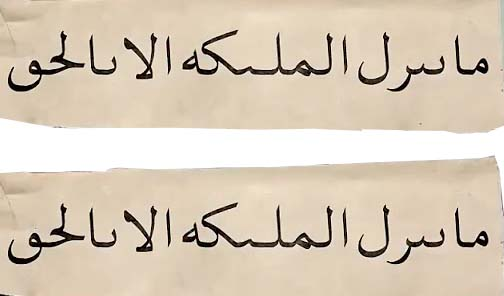

# ادعا

<video src="./claim.mp4" controls>

# جواب 

در کل کره زمین فقط یک قرآن وجود داره که آغازش با الحد لله رَبَّ العالمین و پایانش با مِنَ الجنَتِ و الناسِ است 
و روایت حفض از عاصم و وَرش از نافع دو قرآن مختلف نیستن بلکه دو روایت از قرائت قرآنه 
در زبان عربی قرائت به صورت تحت اللفظی یعنی خواندن و از نظر واژه شناسی به معنی شیوه خوانشه
و قرائت های مختلف قرآن به معنی تفاوت در اصل قرآن نیست بلکه مربوط به تفاوت در نوع خواندن یا تلفظ کلماته 
همونطور که ما در زبان فارسی با چندین لهجه مثل تهرانی  ، اصفهانی ، یزدی و مشهدی حرف میزنیم و یک جمله یکسان با لهجه های مختلف  گفته میشه در زبان عربی هم به همین شکله لهجه های متفاوتی وجود داره و مردم هر منطقه و قبیله قرآن رو با لهجه خودشون  قرائت میکردن
حالا بیایم باهمدیگه قرآن به روایت وَرش از نافع با قرآنی که به روایت حفض از عاصم است رو باهم برسی کنیم که آیا واقعا به قول ایشون اختلاف دارن یا نه
در سوره حجر آیه 8 به روایت حفص از عاصم میگه 

### ما فرشتگان را نمی فرستیم مگر به حق
و در روایت وَرش از نافع میگه :

### فرشتگان نازل نمی شوند مگر به حق
که پیام هر دو اینه که نزول فرشته ها تنها زمانیه که وظیفه الاهی دارن نه برای نمایش یا درخواست بیهوده افراد از پیامبر
و از همه مهمتر اینکه نسخه های اولیه قرآن در زمان پیامبر بدون نقطه و اعراب بوده و مسلمانان طبق لحجه ی خودشون تو هر منطقه ای قرآن را میخوندن و در همه لحجه ها مفهوم و پیام آیه ها باهم برابره 
که بعد ها با گسترش اسلام و اسلام آوردن ملت های غیر عرب برای اینکه اونها  در خوندن قرآندچار اشتباه نشن نقطه گذاری و اعراب گذاری شد و اگر باهم بیایمنقطه ها و اعراب هارا از این دو قرائت برداریم و با هم مقایسه کنیم می بینیم که دقیقا فرم نوشتاری اونها باهم یکیه و هیچ اختلاقی در اونها دیده نمیشه

    
    
    
    

در همه جای دنیا و هر قرآنی با هر قرائتی را که باز کنیم تعداد سوره ها ، تعداد آیه ها و حتی **تعداد کلمات** حتی با هم برابره